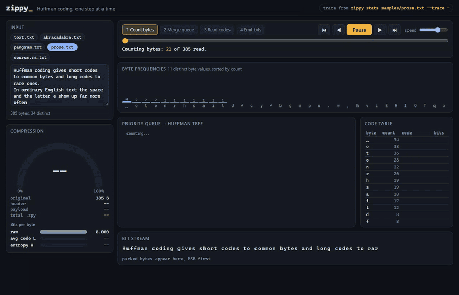
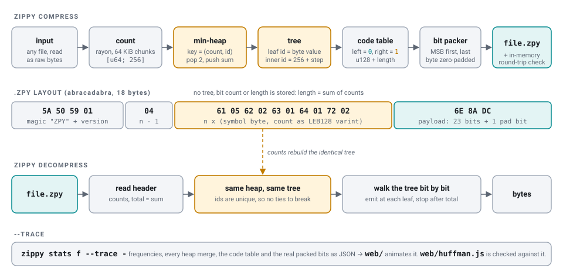
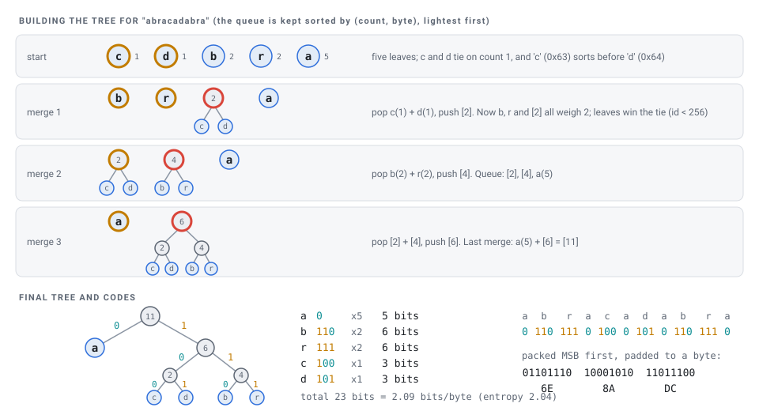

# zippy

**Live demo:** https://zippy-mocha.vercel.app

A Huffman compressor in Rust, plus a browser visualizer that replays the real compressor's work step by step.



([demo.mp4](docs/media/demo.mp4) has the full-length recording.)

## What it does

`zippy` compresses any file, text or binary, with static Huffman coding. It writes a small `.zpy` container that
`zippy decompress` can unpack with nothing else to go on. Every `compress` decodes its own output in memory
and checks it against the input before it reports success.

```
$ zippy stats samples/prose.txt
samples/prose.txt
original                 385 B
distinct bytes            34
header                    73 B
payload                  205 B  (1638 bits)
compressed               278 B  (72.2% of original)
payload only            53.2 %  of original
entropy H             4.1991 bits/byte
avg code len L        4.2545 bits/byte
efficiency H/L         98.70 %
longest code               9 bits
round-trip                OK
```

The sizes are exact byte counts of the file that `compress` would write. `H` is the Shannon entropy of the
byte distribution and `L` is the average code length actually achieved. Huffman guarantees `H <= L < H + 1`.

With `--trace` the binary also dumps what it did as JSON: the byte frequencies, every priority-queue merge,
the final code table, and a sample of the packed bit stream. The page in `web/` animates that trace.

## Quick start

Needs a stable Rust toolchain (edition 2024, so Rust 1.85 or newer).

```sh
cargo build --release
cargo test --release

./target/release/zippy compress   samples/prose.txt              # writes samples/prose.txt.zpy
./target/release/zippy decompress samples/prose.txt.zpy -o out.txt
./target/release/zippy stats      samples/prose.txt
./target/release/zippy stats      samples/prose.txt --trace -    # JSON trace to stdout
./target/release/zippy compress   big.bin --timings              # per-stage timings on stderr
```

On Windows the binary is `target\release\zippy.exe`. Commands can be shortened to `c`, `d` and `s`.

### Visualizer

Open `web/index.html` in a browser. It needs no build step and no server, because the traces are bundled in
`web/traces.js`. You can also serve it with `python -m http.server -d web 8109` and go to `http://localhost:8109`.

- The sample chips load traces produced by the real binary (`zippy stats samples/<file> --trace -`).
- Typing in the box, or dropping a file on it, runs `web/huffman.js`, a JavaScript port of `src/huffman.rs`.
  The header badge tells you which of the two produced what you are looking at.
- Controls: Play/Pause (Space), step (arrow keys), the timeline scrubber, and a click on a phase name to jump to it.

To regenerate the traces after changing the Rust code or adding a sample:

```sh
cargo build --release && node web/build-traces.js
```

That script runs the binary on every file in `samples/`, writes `web/traces/*.json` and `web/traces.js`, then
runs the JS port on the same bytes. It exits non-zero if the merges, codes, packed bits or stats differ at all.
Right now they are identical on every sample. I also checked a UTF-8 string with multi-byte characters.

## How it works



1. **Count.** Bytes are counted into a `[u64; 256]` table. rayon counts 64 KiB chunks in parallel and sums them.
2. **Build the tree.** Every byte that occurs becomes a leaf in a `BinaryHeap` min-queue. The two lightest nodes
   are popped and joined under a new parent until one tree is left.
3. **Read the codes.** Walking the tree gives each byte its code: `0` for a left edge, `1` for a right edge.
   Common bytes sit near the root and get short codes.
4. **Pack.** Codes are written MSB-first into a byte buffer, and the last byte is zero-padded.
5. **Decode.** The decompressor reads the counts, rebuilds the same tree, and walks it one bit at a time. It emits a
   byte at each leaf and stops once it has emitted `sum(counts)` bytes, so the padding is never mistaken for data.



### Deterministic ties

The decompressor rebuilds the tree from the counts alone, so the build has to be a pure function of the counts.
Each node has an id. A leaf's id is its byte value (0-255), and an internal node's id is 256 plus its merge step.
The heap orders nodes by `(weight, id)`. That key is unique, so ties never depend on insertion order or hash-map
iteration order. It also makes the JS port easy to check: any correct min-heap pops the same sequence.

### The .zpy format

| bytes           | meaning                                                       |
|-----------------|---------------------------------------------------------------|
| `5A 50 59 01`   | magic `ZPY` + format version 1                                |
| 1 byte          | number of distinct bytes minus one                            |
| n entries       | symbol byte, then its count as an unsigned LEB128 varint      |
| rest            | Huffman payload, MSB first, last byte zero-padded             |

An empty input is stored as the magic plus `FF`, 5 bytes in total. A file that uses only one byte value gets the
code `0` for that byte, so it still round-trips. The decoder rejects bad magic, duplicate or zero counts, and
truncated payloads.

## Project layout

```
src/main.rs        CLI: compress / decompress / stats, --trace, --timings, container tests
src/huffman.rs     frequency count, heap + tree, code table, bit packer, decoder, entropy, unit tests
src/container.rs   .zpy header read/write
src/trace.rs       byte-accurate stats and the hand-written JSON trace
samples/           small inputs used for the shipped traces
web/index.html     visualizer (plain HTML/CSS/JS, no build step)
web/app.js         timeline, histogram, animated forest/tree, code table, bit stream, gauge
web/huffman.js     JS port of src/huffman.rs, used for live typing only
web/build-traces.js  regenerates web/traces/*.json + web/traces.js and checks the JS port
docs/media/        demo recording, screenshots, diagrams
```

## Design notes and trade-offs

- **Bugs fixed from the first version.** It cast each byte to a `char`, so non-ASCII text came back
  re-encoded and garbled. `read_to_string` rejected binary files. The text header (`<char> <count>` per line) broke on spaces and newlines. Ties in the heap depended on `HashMap` iteration order, so a separate decompress run
  could rebuild a different tree. Empty and single-symbol inputs panicked or decoded to nothing. zippy now works
  on raw bytes, with a binary header and the deterministic ordering described above.
- **Storing counts rather than code lengths.** The header stores the full counts, about 2-3 bytes per distinct
  byte, so the decoder can rerun the exact same algorithm. Canonical Huffman would store only code lengths,
  about 1 byte per symbol. That would shrink the header, but then the codes would no longer be read straight off the
  heap-built tree, which is the tree the visualizer shows. On tiny inputs the header dominates, which is why `abracadabra` grows from
  11 B to 18 B while its payload is 3 B.
- **Where rayon helps.** The original commit message says parallelism "didn't help", and for encoding and
  decoding that is still true, because both are sequential bit streams. Counting is the one stage that splits
  cleanly, so rayon is used only there. On about 5.4 MB of concatenated source files, counting takes about 1.5 ms,
  encoding about 55 ms and the tree-walking decode about 165 ms. A table-driven decoder would be the next speedup.
- **Codes up to 128 bits.** Codes are held in a `u128`. With 64-bit counts the deepest possible tree is well
  under that.
- **Hand-written JSON.** rayon is the only dependency. The trace format is small enough that it did not seem
  worth pulling in serde for it.

## Media

- `docs/media/demo.gif`, `docs/media/demo.mp4`: recorded from the visualizer with Playwright
- `docs/media/merge-queue.png`, `emit-bits.png`, `code-paths.png`, `source-done.png`: screenshots
- `docs/media/pipeline.svg`, `abracadabra.svg`: diagrams, which follow GitHub's light or dark theme
